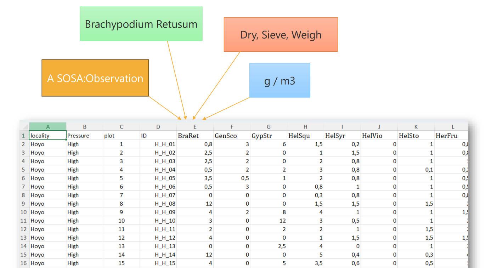
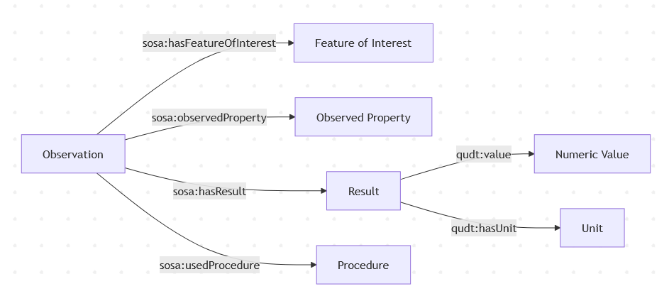

## Program of this workshop

- Introduction to interoperability in soil data (13.45)
- 2 case studies of soil data in practice
   - Monne Weghorst: personal experiences with structuring data (14.00)
   - Keiji Jindo:  3 use-cases related to soil sampling and soil analysis (14.15)
- SoilWise suggestions to enhance interoperability (14.30)
- Q&A / Hands-on session (+menti) (14.45)

## Interoperability in FAIR

- Use a formal, accessible, shared language for knowledge representation
- Use vocabularies that follow the FAIR principles
- Include qualified references to other (meta)data

## What formal languages are we using in soil?

- Harmonised World Soil Database / eSOTER
- ISO28258:2013 / Observations, Measurements and Samples (OMS) / INSPIRE Soil
- GLOSIS LD / SOSA
- ...

## So...

Limited adoption, due to: 

- Complexity and lack of tools
- Lack of awareness and incentives

## Which vocabularies are we using in soil?

- World Reference Base, USDA Soil Taxonomy, Dutch Soil Classification, etc.
- FAO Guidelines for Soil Description
- Agrovoc, Gemet, INRAE thesaurus
- GBIF vocabularies, NCBI Taxonomy, etc.

## So...

- Slight adoption, but often not in a machine-readable format, and often not used in a consistent way
- No concensus on vocabularies for soil properties and sampling/lab procedures 

## What are qualified references?

- A cross-reference that explains its intent
- For example, Magnesium content is measured using Mehlich-3 is a more qualified reference than Magnesium is related to Mehlich-3.

## Is the soil domain special?

In general, **no**, all science domain struggle with interoperability, however:

- Changes in soil are slow, so legacy data is often used, and require long term experiments (IT trends change faster than soil)
- We have a long history of standardization efforts, at the time of writing FAIR was not a topic

## Some examples

- [10.5281/zenodo.17422778](https://doi.org/10.5281/zenodo.17422778)
- [10.5281/zenodo.20067150](https://doi.org/10.5281/zenodo.20067150)
- [10.5281/zenodo.20508989](https://doi.org/10.5281/zenodo.20508989)
- [10.5281/zenodo.15040664](https://doi.org/10.5281/zenodo.15040664)
- [10.18167/DVN1/PWM9WW](https://doi.org/10.18167/DVN1/PWM9WW)
- [10.4121/f0539cee-c288-42ff-872d-af11320e183c](https://doi.org/10.4121/f0539cee-c288-42ff-872d-af11320e183c)
- [10.4121/21632186](https://doi.org/10.4121/21632186)

## The [SoilWise project](https://www.soilwise-he.eu)

- Aims to increase reusability of soil data and knowledge within the European Union Soil Observatory
- Builds a [catalog for soil data and knowledge](https://catalogue.soilwise-he.eu), a [soil vocabulary](https://w3id.org/eusoilvoc) and [guidances around data publication](https://soilwise-he.github.io/soilwise-fair-strategy/use-cases/)
- Funded by the EU Horizon program
- Running from 2024 - 2027
- ISRIC, WENR Earth Informatics and Wageningen University in a consortium with 10 other partners across Europe

## The [Soilharmony project](https://doi.org/10.5194/egusphere-egu26-22403)

- The 4 year project kicked off this week.
- Aims to develop transfer functions to support the implementation of the soil monitoring law
- WENR is one of 13 consortium partners
- The envisioned system builds on existing standardisation efforts

## Let's get started

- 2 soil scientists from different corners of soil
- How do you publish your data, and what challenges do you face?
- Do the soilwise suggestions make sense?
- I invite you to reflect on your own experiences based on their stories

## Monne Weghorst: personal experiences with structuring data

## Keiji Jindo:  3 use-cases related to soil sampling and soil analysis.

## SoilWise suggestions to enhance data interoperability

We identified 3 approaches based on different use cases

- A basic annotation of tabular data (excel, csv)
- A relational database approach including annotations (geopackage)
- A semantic web approach using RDF and ontologies

## Tabular data annotation

## HowTo...?

- A [Excel Template](https://github.com/soilwise-he/soil-observation-data-encodings/)
- A basic [CSV approach](https://github.com/KALRO-ICT/kensis-data/tree/main/data) (embargo)
- The full [CSV-W approach](https://github.com/soilwise-he/soil-observation-data-encodings/)

## CSV on the Web

- [CSVW](https://www.w3.org/TR/tabular-data-primer/) is a W3C standard
- Columns of a tabular dataser are annotated in a sidecar file 
- [RDF tooling](https://pypi.org/project/csvwlib/) can serialize the CSV+CSVW to RDF formats (ttl, json-ld, ...)

## And then...?

- Which common model for observation data and qualified referencesto use? 
- The [SOSA ontology](https://www.w3.org/TR/vocab-ssn/) provides annotation options for measurement and observation data
- [EU SoilVoc](https://w3id.org/eusoilvoc) provides identifiers of common soil properties and procedures

## SOSA

## And then...?

- Upload the dataset onto Zenodo/4TU, referencing the approach used
- [Convert the dataset](https://api.soilwise.wetransform.eu/csvw/docs) to RDF/Geopackage before uploading to Zenodo
- Use [F-UJI tool](https://www.f-uji.net/) to understand the FAIR-ness of your publication

## Q&A - Hands on...

Join our menti.com [3862 7420](https://www.mentimeter.com/app/presentation/alq4rfmkfxfr9smqmp55dbowo68jdnif/present?question=6itu18q8816x)

